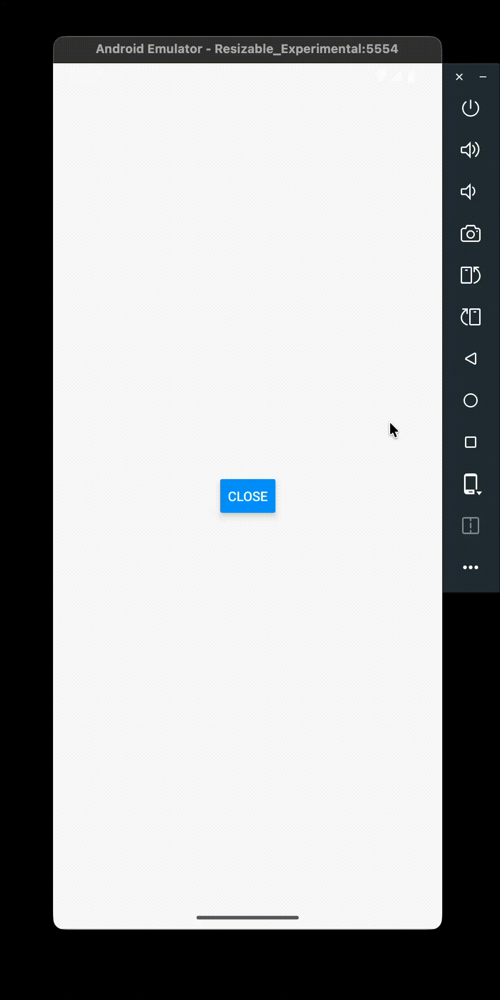

# expo-app-exit

`expo-app-exit`는 다음 기능을 지원합니다.

1. 📱 모듈 이름에 걸맞게 무려 앱을 종료할 수 있습니다.
2. 💃 iOS에서 우아하게 앱을 종료할 수 있습니다.

## 예시 화면

<table>
<tr>
<td>

</td>
<td>

</td>
</tr>
<tr>
<td align="center">iOS</td><td align="center">Android</td>
</tr>
</table>

## 주의사항

- ❌ Expo Go로는 사용할 수 없습니다.
- ✅ expo-dev-client가 필요합니다. 아무 플러그인도 필요하지 않습니다.

## 설치

1. 패키지를 설치합니다.

```shell
# npm
npm i expo-app-exit

# bun
bun i expo-app-exit
```

2. CocoaPods를 설치합니다. (Expo는 스킵해도 됩니다)

```shell
cd ios
pod install
```

3. 프로젝트를 빌드합니다.

```shell
# Expo
npx expo run:android
npx expo run:ios

# React Native
npx react-native run-android
npx react-native run-ios
```

## 코드 예시

```jsx
import AppExit from 'expo-app-exit';
import { Button } from 'react-native';

export default function App() {
    return <Button title="Close" onPress={() => AppExit()} />;
}
```
